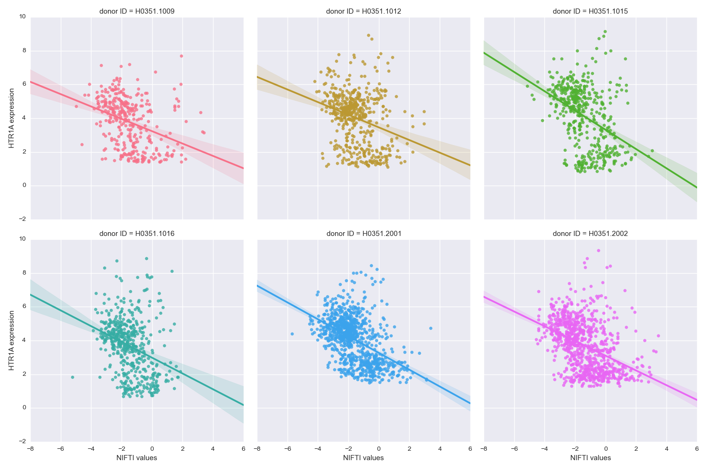

alleninf
========

Compare an unthresholded statistical map of a brain with gene expression patterns from [Allen Human Brain Atlas](http://human.brain-map.org/). See the [OHBM 2014 poster](http://f1000research.com/posters/1097120) for more details.

**This pacakge is depracated** in favour of the Gene Decoding functionality available for the maps uploaded to [NeuroVault](http://NeuroVault.org).
Installation
------------

    pip install git+https://github.com/chrisfilo/alleninf.git

Usage
-----

	usage: scripts.py [-h] [--inference_method INFERENCE_METHOD]
	                  [--n_samples N_SAMPLES] [--n_burnin N_BURNIN]
	                  [--probes_reduction_method PROBES_REDUCTION_METHOD]
	                  [--mask MASK] [--radius RADIUS]
	                  [--probe_exclusion_keyword PROBE_EXCLUSION_KEYWORD]
	                  stat_map gene_name
	
	Compare a statistical map with gene expression patterns from Allen Human Brain
	Atlas.
	
	positional arguments:
	  stat_map              Unthresholded statistical map in the form of a 3D
	                        NIFTI file (.nii or .nii.gz) in MNI space.
	  gene_name             Name of the gene you want to compare your map with.
	                        For list of all available genes see: http://help.brain-map.org/download/attachments/2818165/HBA_ISH_GeneList.pdf?version=1&modificationDate=1348783035873.
	
	optional arguments:
	  -h, --help            show this help message and exit
	  --inference_method INFERENCE_METHOD
	                        Which model to use: fixed - fixed effects,
	                        approximate_random - approximate random effects
	                        (default), bayesian_random - Bayesian hierarchical
	                        model (requires PyMC3).
	  --n_samples N_SAMPLES
	                        (Bayesian hierarchical model) Number of samples for
	                        MCMC model estimation (default 2000).
	  --n_burnin N_BURNIN   (Bayesian hierarchical model) How many of the first
	                        samples to discard (default 500).
	  --probes_reduction_method PROBES_REDUCTION_METHOD
	                        How to combine multiple probes: average (default) or
	                        pca - use first principal component (requires scikit-
	                        learn).
	  --mask MASK           Explicit mask for the analysis in the form of a 3D
	                        NIFTI file (.nii or .nii.gz) in the same space and
	                        dimensionality as the stat_map. If not specified an
	                        implicit mask (non zero and non NaN voxels) will be
	                        used.
	  --radius RADIUS       Radius in mm of of the sphere used to average
	                        statistical values at the location of each probe
	                        (default: 4mm).
	  --probe_exclusion_keyword PROBE_EXCLUSION_KEYWORD
	                        If the probe name includes this string the probe will
	                        not be used.

Example
-------

    $ alleninf SetA-SetB_Tstat.nii.gz HTR1A --mask SetA_mean.nii.gz

    Fetching probe ids for gene HTR1A
    Found 3 probes: A_24_P97687, CUST_575_PI417557136, CUST_15880_PI416261804
    Fetching expression values for probes A_24_P97687, CUST_575_PI417557136, CUST_15880_PI416261804
    Found data from 3702 wells sampled across 6 donors
    Combining information from selected probes
    Translating locations of the wells to MNI space
    Checking values of the provided NIFTI file at well locations
    70 wells fall outside of the mask
    Performing approximate random effect analysis
    Correlation between NIFTI values and HTR1A expression averaged across donors = -0.372743 (t=-12.8453, p=5.0909e-05)
    

FAQ
---

### Why is alleninf using different coordinates than those provided by Allen Brain Institute? ###
The coordinates reported by Allen Brain Institute were calculated using an affine coregistration of donor brain T1s to the MNI atlas. We used ANTs to perform a much more accurate non linear corregistration.
In particular T1 scans of the six cadaver brains were coregistered to MNI 152 1mm template. 
The coregistration consisted of four steps (translation, rigid body, affine and 
nonlinear deformation field) and was performed using ANTs (Avants et al., 
2011). Visual inspection revealed that one of the scans (H0351.1016) suffers 
from deformed cerebellum and required manual adjustments of the 
coregistration procedure (separate registration of cerebellum).
